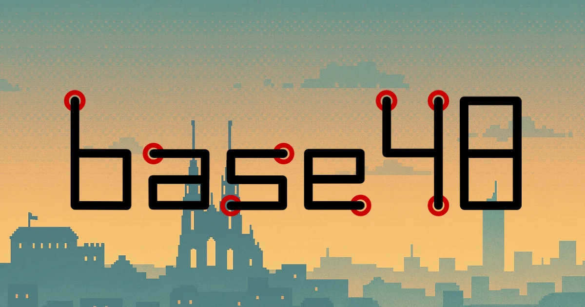

# Base48 - Brněnský hackerspace

[](https://base48.cz)
[](https://github.com/base48/website/blob/main/README.md#credits)
[](https://developer.mozilla.org/en-US/docs/Web/HTML)
[](https://developer.mozilla.org/en-US/docs/Web/CSS)
[](https://developer.mozilla.org/en-US/docs/Web/JavaScript)
[](https://developer.mozilla.org/en-US/docs/Learn/CSS/CSS_layout/Responsive_Design)
[](https://github.com/base48/website)
[](https://www.w3.org/WAI/WCAG21/quickref/)

🔧 **Modern responsive website for Base48 hackerspace in Brno, Czech Republic**



## 🌟 About

Base48 is a community-driven hackerspace and maker workshop located in Brno, Czech Republic. This website serves as the digital front door to our physical space, showcasing our facilities, community, and mission to provide a collaborative environment for DIY projects, electronics, 3D printing, and knowledge sharing.

## ✨ Features

### 🎨 Design & UX
- **Retro-futuristic aesthetic** with CRT monitor frames and pixel art elements
- **Responsive design** that works seamlessly on desktop, tablet, and mobile
- **Dark/Light theme toggle** for optimal viewing experience
- **Smooth animations** and hover effects for enhanced interactivity
- **Accessibility-focused** with proper ARIA labels and semantic HTML
- **One hand usable** all actions are reachable single-handedly

### 🖼️ Interactive Elements
- **Interactive visual features** that make people remember our website
- **Animated satellite sprite** with clickable Easter egg explaining the "48" origin
- **Interactive photo galleries** with lightbox functionality
- **CRT-style frame displays** showcasing different areas of the hackerspace
- **Smooth scrolling navigation** between sections
- **Hamburger menu** for mobile navigation

### 📱 Modern Web Technologies
- **CSS Grid & Flexbox** for responsive layouts
- **CSS Custom Properties** for consistent theming
- **Vanilla JavaScript** for lightweight interactivity
- **WebP images** for optimized loading

## 🛠️ Technology Stack

- **HTML5** - Semantic markup with accessibility features
- **CSS3** - Modern styling with CSS Grid, Flexbox, and custom properties
- **Vanilla JavaScript** - Lightweight, dependency-free interactions
- **WebP Images** - Modern image format for optimal performance
- **Font Awesome** - Icon library for consistent iconography
- **No Build** - Or advanced optimisation for sake of transparency
- **Hosting (server) directives** - Not included in this repository

## 📁 Project Structure

```
├── index.html             # Main HTML file
├── css/                   # Stylesheets
│   ├── main.css            # Main CSS imports
│   ├── variables.css       # CSS custom properties
│   ├── base.css            # Base styles and resets
│   ├── layout.css          # Layout and grid systems
│   ├── components.css      # Reusable component styles
│   ├── responsive.css      # Media queries and responsive design
│   ├── animations.css      # CSS animations and transitions
│   ├── buttons.css         # Button component styles
│   ├── lightbox.css        # Image lightbox functionality
│   ├── crt-effect.css      # Retro CRT monitor effects
│   ├── satellite.css       # Animated satellite sprite
│   ├── fonts.css           # Font declarations
│   └── utilities.css       # Utility classes
├── js/                    # JavaScript files
│   └── main.js             # Main JavaScript functionality
├── img/                   # Images and assets
│   ├── logo/               # Base48 logos
│   ├── gallery/            # Photo gallery images
│   ├── screen/             # CRT screen content images
│   ├── frame/              # CRT frame images
│   └── og/                 # Open Graph images
└── vendor/                # Third-party assets
    └── fa/                 # Font Awesome icons
```

## 🚀 Getting Started

### Prerequisites
- A modern web browser
- Local web server (optional, for development)

### Installation

1. **Clone the repository**
   ```bash
   git clone https://github.com/base48/website.git
   cd website
   ```

2. **Open in browser**
   Open `index.html` directly.


### Responsive Design
- Mobile-first approach
- Flexible grid systems
- Adaptive typography and spacing
- Touch-friendly interactive elements

### Performance Optimizations
- Optimized WebP images with fallbacks
- Efficient CSS organization
- Minimal JavaScript footprint
- Lazy loading for gallery images

## 🤝 Contributing

We welcome contributions to improve the website! Please:

1. Fork the repository
2. Create a feature branch
3. Make your changes
4. Test across different devices/browsers
5. Submit a pull request

### Development Guidelines
- Follow existing code style and organization
- Maintain accessibility standards
- Test responsive design on multiple devices
- Optimize images before adding to the repository
- Document any new features or changes

## 📄 Credits

[](https://github.com/base48/website/graphs/contributors)
[](https://github.com/base48/website/commits/main)
[](https://github.com/base48/website/stargazers)

©left Base48, z.s. Some rights reserved.

---

**Made with ❤️ by the Base48 community**

*prepared by Tomáš "Thebys" Biheler* 